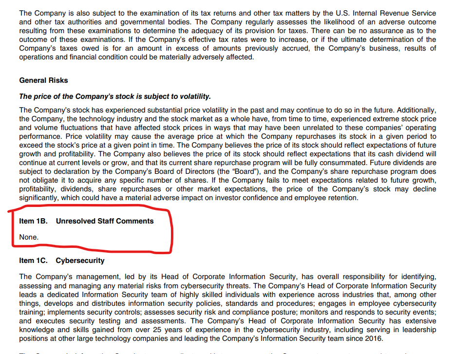

---

# Design Report (1 Page Concept Note)
---

```markdown
# Design Report – Financial RAG System

## Objective

Build a Retrieval-Augmented Generation (RAG) system that answers complex financial and legal questions using Apple’s 2024 10-K and Tesla’s 2023 10-K filings.

Constraints:
- Use only retrieved context
- Cite document sources
- Refuse out-of-scope questions
- Use open-source models only

---

## Document Ingestion & Chunking Strategy

PDFs were loaded using `PyPDFLoader`.

Chunking approach:
- Primary split: RecursiveCharacterTextSplitter (1400 chars, 100 overlap)
- Secondary split: Regex-based splitting by `Item` section headers

Rationale:
SEC filings are structured by Items (Item 1, Item 1A, Item 7, Item 8, etc.). Splitting by section headers improves semantic coherence and retrieval precision.

Metadata preserved:
- `document` (Apple 10-K / Tesla 10-K)
- `item` (Item 1B, etc.)
- `page` (Page number - index 1)

---

## Text Enrichment
Some of the chunks after applying the above logic turned out to be small. In particular question #5 of the evaluation set:
`Does Apple have any unresolved staff comments from the SEC as of this filing? How do you know?`
The relevant chunk for this question is in page 20 of the document for Apple:

Similarity score for this chunk with the query was very low as compared to other chunks. In order to enrich such short chunks generic words such as "Apple SEC 10-K report" were added. This led to an improved similarity and thus the LLM inference came out accurate.

## Embeddings & Vector Store

Embedding model:
- `BAAI/bge-base-en-v1.5`

Vector store:
- FAISS

---

## Retrieval & Reranking

Pipeline:
1. Top-20 similarity retrieval
2. Cross-encoder reranking using `BAAI/bge-reranker-base`
3. Top-5 chunks sent to LLM

Why reranking?
Financial documents contain semantically similar phrases:
- “Total term debt”
- “Total term debt principal”

Accuracy:
Recall@5: 20 document chunks are retrieved and 5 are selected from the candidates
Current Recall@5 is 11/13 or ~84%

---

## LLM Selection

Model Selected:
- `mistralai/Mistral-7B-Instruct-v0.3`

Reasons:
- Open-source
- Strong instruction-following capability
- Efficient inference

Prompt Engineering:
- Context-only answering
- Few shot prompting
- No hallucinations
- One-sentence output

---

## Out-of-Scope Handling

If:
- Answer not present in retrieved context
- Question requires future knowledge
- Question unrelated to documents

System responds:

"This question cannot be answered based on the provided documents."

---


## Limitations

- Table extraction is text-based (no structured table parsing) - scope for future work
- Large model inference may require GPU for efficiency - current model runs on H100 on Kaggle

---